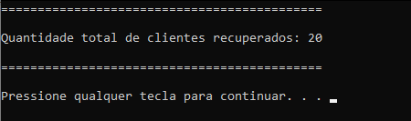
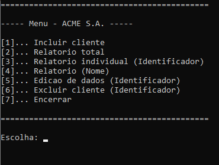
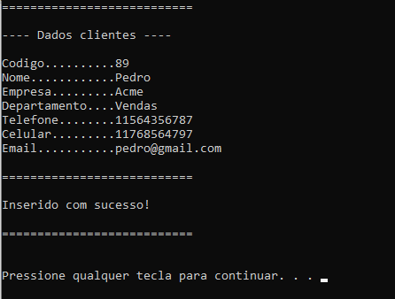
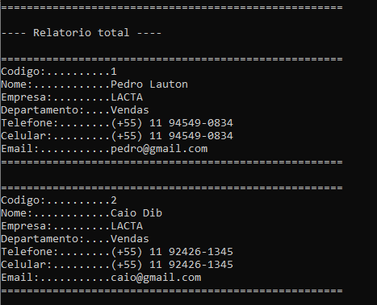
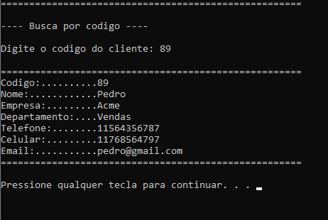
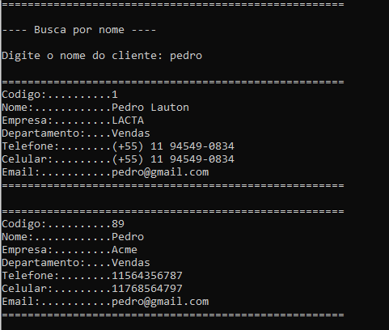
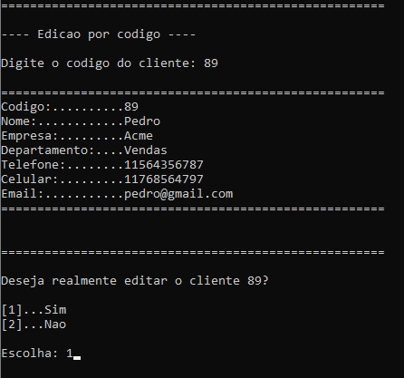
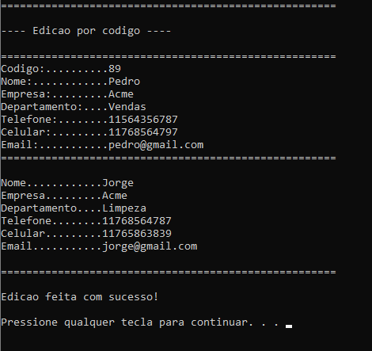
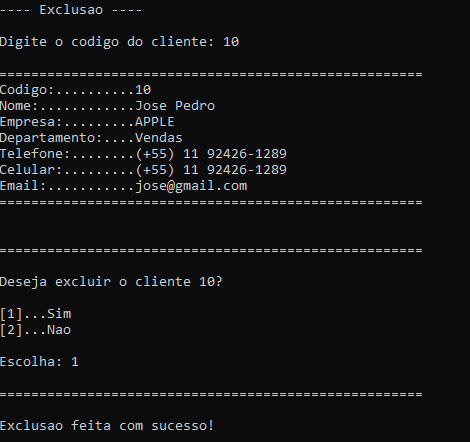

# Projeto de Estrutura de Dados - Controle de Clientes

Este é um projeto em C que implementa um sistema para controle de inserção, relatório, edição e exclusão de clientes. O sistema utiliza estruturas de dados como lista ligada, alocação dinâmica de memória, funções e tipos abstratos de dados para garantir um gerenciamento eficiente dos clientes.

## Funcionalidades

- **Inserção de Clientes:** Permite adicionar novos clientes ao sistema.
- **Relatório de Clientes:** Gera um relatório com informações dos clientes cadastrados.
- **Edição de Clientes:** Permite modificar as informações de um cliente existente.
- **Exclusão de Clientes:** Remove um cliente do sistema.
- **Backup de Dados:** Os dados são salvos em um arquivo de texto binário para persistência entre execuções. Ao iniciar o programa novamente, os dados são recuperados automaticamente.

## Tecnologias Utilizadas

- **Linguagem de Programação:** C
- **Estrutura de Dados:** Lista Ligada
- **Alocação de Memória Dinâmica:** Para manipulação dos dados dos clientes.
- **Funções:** Organização e modularização do código.
- **Tipo Abstrato de Dados (TAD):** Encapsula a estrutura de dados dos clientes e suas operações.
  
## Prints

**Backup:**

**Menu:**

**Inserção de clientes:**

**Relatório total:**

**Relatório por código:**

**Relatório por nome:**

**Edição:**

**Exclusão:**

## Contribuintes

- Caio Dib;
- Pedro Lauton.
